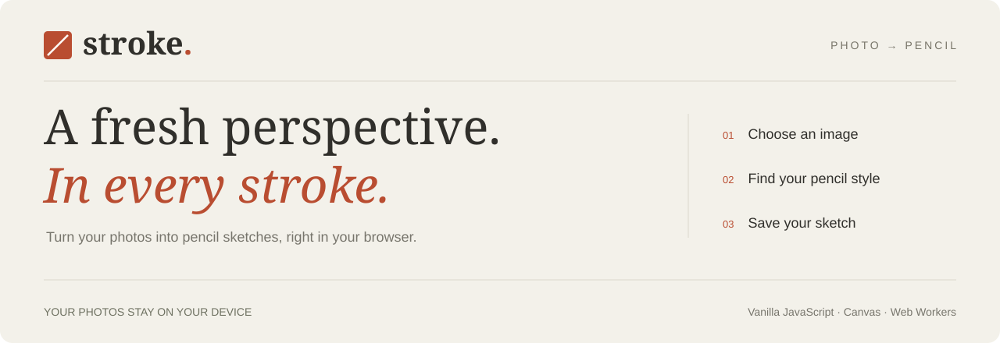
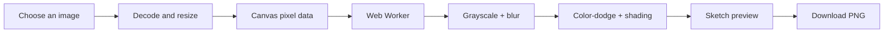

<p align="center">
  <a href="https://yevheniimalin.github.io/sketch-portrait/">
    
  </a>
</p>

<p align="center">
  <a href="https://yevheniimalin.github.io/sketch-portrait/"><strong>Try the live demo ↗</strong></a>
  &nbsp; · &nbsp;
  <a href="#how-it-works">How it works</a>
  &nbsp; · &nbsp;
  <a href="#run-locally">Run locally</a>
  &nbsp; · &nbsp;
  <a href="https://github.com/YevheniiMalin/sketch-portrait/issues">Report an issue</a>
</p>

<p align="center">
  <a href="https://github.com/YevheniiMalin/sketch-portrait/actions/workflows/pages.yml"></a>
  
  
</p>

# Stroke

**A small creative tool with a simple promise: photo in, pencil sketch out.**

Stroke transforms photos and drawings into adjustable monochrome sketches. Everything runs in the browser: choose an image, tune the pencil effect, compare it with the original, and download a PNG. No account, image uploads to a server, or paid API is needed.

## What you can do

| Feature | Experience |
| --- | --- |
| **Drop in an image** | Use the file picker or drag and drop a photo or drawing. |
| **Make it yours** | Adjust pencil strength and stroke width with live previews. |
| **Compare the result** | Switch between the original image and the sketch. |
| **Keep the result** | Download a PNG with no watermark. |
| **Work privately** | Image processing stays on your device; the app sends no image data to a server. |
| **Use any screen** | Responsive layout with labeled controls and keyboard focus states. |

## Engineering highlights

- **Processing off the main thread.** A Web Worker handles the pixel calculations so the interface can stay responsive.
- **Linear-time blur.** A separable sliding-window box blur avoids scanning a full neighborhood for every pixel. Three passes approximate a Gaussian blur.
- **Controlled updates.** Slider input is debounced, and request IDs prevent outdated processing results from replacing newer settings.
- **Bounded output size.** Large images are scaled to a maximum of 2400 pixels on their longest edge to limit processing and memory costs.
- **A small deployment surface.** Plain HTML, CSS, and JavaScript, with no frontend framework, build step, or application backend.

## How it works



The worker converts pixels to grayscale, smooths a copy of the image, and combines the two using color-dodge blending to bring out contours. A small amount of the original tonal information preserves shading. Pencil strength controls the darkness; stroke width changes the blur radius.

This is a deterministic image-processing filter. It preserves the original composition rather than generating a new portrait or automatically cropping a face.

## Built with

| Layer | Technology |
| --- | --- |
| Interface | Semantic HTML, responsive CSS, vanilla JavaScript |
| Image input and export | File API, Canvas 2D, Blob URLs |
| Processing | Web Workers and typed arrays |
| Checks | Node.js built-in assertions and JavaScript syntax checks |
| Hosting | GitHub Pages, deployed through GitHub Actions |

## Run locally

Install Node.js, then:

```sh
git clone https://github.com/YevheniiMalin/sketch-portrait.git
cd sketch-portrait
node server.cjs
```

Open **[localhost:8080](http://localhost:8080)**. There is no `npm install` step.

You can also serve `dist/` with any static HTTP server. Use HTTP rather than opening `index.html` directly: browsers may block Web Workers on `file://` URLs.

## Project structure

```text
dist/
  index.html       Page structure and accessible controls
  style.css        Responsive design
  app.js           Upload, preview, settings, and PNG export
  worker.js        Background processing and message handling
  sketch.js        Grayscale, blur, and pencil-effect algorithm
docs/
  banner.svg       Repository header
.github/workflows/
  pages.yml        Checks and GitHub Pages deployment
server.cjs         Local static server
test.cjs           Image-processing checks
```

## Validation

```sh
node --check dist/app.js
node --check dist/worker.js
node --check dist/sketch.js
node test.cjs
```

The automated checks cover white backgrounds, transparent pixels, narrow images, blur boundaries, grayscale output, pencil strength, and edge contrast. Browser checks have also covered image loading, changing settings, PNG download, invalid-file feedback, and the mobile layout.

The deployment workflow runs checks before publishing `dist/`. For a fork, enable **Settings → Pages → Source → GitHub Actions**.

## Current limits

- **25 MB** maximum input file size; **2400 px** maximum output long edge.
- JPG, PNG, and WebP are recommended. Other formats depend on the browser; HEIC may need conversion first.
- Transparent areas become white. Animated images use a single frame.
- Fine textures, lighting, and background detail affect the sketch. The tool does not remove backgrounds or isolate faces.

---

Created by **[Yevhenii Malin](https://github.com/YevheniiMalin)** · [Open Stroke](https://yevheniimalin.github.io/sketch-portrait/)
